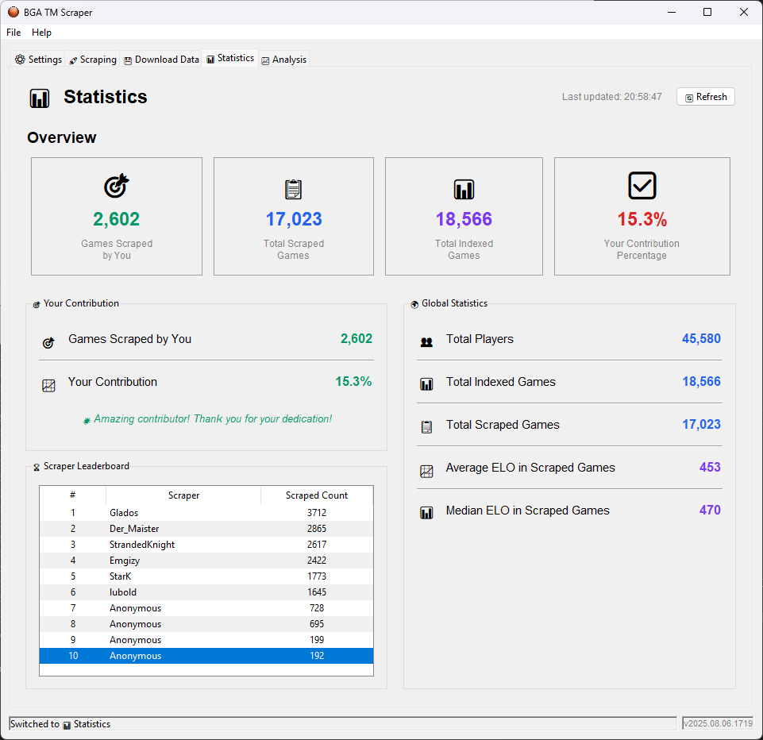

# Terraforming Mars BGA Scraper

A comprehensive Python tool for scraping and analyzing Terraforming Mars game data from BoardGameArena. Features both a powerful CLI interface and a user-friendly desktop GUI application.

## 🚀 Quick Start

### Desktop GUI (Recommended for most users)



#### **Windows Executable Download**
For Windows users who prefer not to install Python, you can download the latest pre-built executable from the [releases page](https://github.com/HStrand/bga-tm-scraper/releases/latest). Simply download the `.exe` file and run it directly - no installation required!

#### **Python Installation**
```bash
pip install -r requirements_gui.txt
python gui_main.py
```

### Command Line Interface
```bash
pip install -r requirements.txt
python main.py status
```

## 📋 Table of Contents

- [Overview](#overview)
- [Installation](#installation)
- [GUI Application](#gui-application)
- [CLI Interface](#cli-interface)
- [Configuration](#configuration)
- [How It Works](#how-it-works)
- [File Organization](#file-organization)
- [Analysis Tools](#analysis-tools)
- [Troubleshooting](#troubleshooting)
- [Contributing](#contributing)

## Overview

### 🎯 What This Tool Does
- **Indexes Terraforming Mars games** from BoardGameArena table pages
- **Scrapes game logs** from BoardGameArena replay pages
- **Extracts comprehensive game information** including moves, resources, VP progression
- **Provides analysis tools** for studying game patterns and strategies
- **Supports both local and cloud workflows** with API integration

### 🔧 Two Interfaces Available

#### **Desktop GUI** - User-friendly interface with:
- Visual progress tracking and statistics
- Assignment-based scraping system
- Built-in data download and analysis
- No command-line knowledge required

#### **CLI Interface** - Powerful command-line tool with:
- Flexible batch processing
- Advanced filtering and targeting options
- Integration with existing workflows
- Scriptable automation

## Installation

### System Requirements
- **Python 3.7+**
- **Google Chrome browser** (latest version recommended)
- **Windows/macOS/Linux** (tested on Windows 11)

### Quick Setup

1. **Clone the repository**
   ```bash
   git clone <repository-url>
   cd bga-tm-scraper
   ```

2. **Choose your interface and install dependencies**
   
   **For GUI users:**
   ```bash
   pip install -r requirements_gui.txt
   ```
   
   **For CLI users:**
   ```bash
   pip install -r requirements.txt
   ```

3. **Configure your settings**
   ```bash
   cp config.example.py config.py
   # Edit config.py with your BGA credentials
   ```

4. **Verify installation**
   
   **GUI:**
   ```bash
   python gui_main.py
   ```
   
   **CLI:**
   ```bash
   python main.py status
   ```

### Important Notes
- **ChromeDriver is installed automatically** - no manual setup required!
- **BGA Daily Replay Limit**: BoardGameArena limits replay access per day
- **API Key**: Optional for cloud features and assignments

## GUI Application

### 🖥️ Desktop Interface Features

The GUI provides a complete scraping solution with visual feedback and easy configuration.

#### **Main Features:**
- **🔧 Settings Management**: Configure BGA credentials, browser settings, and API keys
- **📋 Assignment System**: Get scraping tasks from the central registry
- **🚀 Progress Tracking**: Real-time progress bars and activity logs
- **📊 Statistics Dashboard**: View your contributions and community stats
- **💾 Data Download**: Export datasets in JSON or CSV format

#### **Getting Started with GUI:**

1. **Launch the application**
   ```bash
   python gui_main.py
   ```

2. **Configure settings** (Settings tab)
   - Enter your BGA email and password
   - Set API key (optional, for assignments)
   - Adjust scraping preferences

3. **Get an assignment** (Assignment tab)
   - Click "Get Assignment" to receive a scraping task
   - Choose between "Index Games" or "Collect Logs"
   - Review assignment details

4. **Start scraping** (Scraping tab)
   - Click "Start Scraping" to begin
   - Monitor progress in real-time
   - View detailed activity logs

5. **Check statistics** (Statistics tab)
   - See your contribution metrics
   - View community leaderboards
   - Track your progress over time

6. **Download data** (Download tab)
   - Export complete datasets
   - Choose JSON or CSV format
   - Monitor download progress

#### **Assignment Types:**

**Index Games**: Fast metadata collection
- Extracts ELO data on players and basic game info
- Scrapes game metadata like table configuration and map

**Collect Logs**: Detailed game analysis
- Downloads complete replay data
- Processes move-by-move game logs
- Extracts full game state information
- Provides rich data for analysis

### 📱 GUI Screenshots and Workflow

The GUI is organized into tabs for different functions:
- **Settings**: One-time configuration
- **Assignment**: Get tasks from the registry
- **Scraping**: Execute tasks with progress tracking
- **Statistics**: View contributions and community data
- **Download**: Export data for analysis

## CLI Interface

### 🖥️ Command Line Features

The CLI provides powerful batch processing and automation capabilities.

#### **Available Commands:**

### `scrape-tables` - Table metadata scraping
Scrapes table pages to identify Arena games and extract metadata.

```bash
# API mode - gets players from cloud API (requires API_KEY)
python main.py scrape-tables

# Manual mode - specific players
python main.py scrape-tables 12345678 87654321

# Composite key mode - specific games
python main.py scrape-tables 670153426:91334215 665079560:86296239

# Mixed mode - combine player IDs and composite keys
python main.py scrape-tables 12345678 670153426:91334215

# Upload to API
python main.py scrape-tables --upload-to-api 12345678
```

### `scrape-complete` - Full workflow
Complete scraping: tables + replays + parsing in one command.

```bash
# Process all players
python main.py scrape-complete --all --update-players

# Specific players
python main.py scrape-complete 12345678 87654321

# Specific games via composite keys
python main.py scrape-complete 670153426:91334215 665079560:86296239

# Upload parsed games to API
python main.py scrape-complete --upload-to-api 12345678

# Retry failed games
python main.py scrape-complete 12345678 --retry-failed
```

### `scrape-replays` - Replay processing
Scrapes replays and parses games (requires existing table HTML).

```bash
# Process all games needing replays
python main.py scrape-replays

# Specific games
python main.py scrape-replays 670153426:91334215 665079560:86296239

# Upload to API
python main.py scrape-replays --upload-to-api
```

### `parse` - Game parsing only
Parses games with existing HTML files.

```bash
# Parse all ready games
python main.py parse

# Parse specific games
python main.py parse 670153426:91334215 665079560:86296239

# Reparse already parsed games
python main.py parse --reparse

# Upload to API
python main.py parse --upload-to-api 670153426:91334215
```

### `update-players` - Player registry management
Updates the player registry with latest leaderboard data.

```bash
# Default count (from config)
python main.py update-players

# Specific number of top players
python main.py update-players --count 500
```

### `status` - Registry information
Shows current state of the games registry.

```bash
# Basic status
python main.py status

# Detailed breakdown
python main.py status --detailed
```

#### **Composite Key Format:**
Use `table_id:player_perspective` to target specific games:
- `670153426:91334215` = Table 670153426 from player 91334215's perspective
- Allows precise control over which games to process

#### **Common Workflows:**

**Initial Setup:**
```bash
# 1. Update player registry
python main.py update-players --count 100

# 2. Check status
python main.py status --detailed

# 3. Start scraping
python main.py scrape-complete --all
```

**Targeted Processing:**
```bash
# Process specific players
python main.py scrape-complete 12345678 87654321

# Process failed games
python main.py scrape-replays 670153426:91334215 --retry-failed

# Reparse with new parser version
python main.py parse --reparse
```

## Configuration

### Basic Configuration (`config.py`)

```python
# BGA Credentials (Required)
BGA_EMAIL = "your_email@example.com"
BGA_PASSWORD = "your_password"

# API Integration (Optional)
API_KEY = "your_api_key_here"  # For cloud features

# Browser Settings (Auto-configured)
CHROMEDRIVER_PATH = None  # Uses webdriver-manager (recommended)
CHROME_PATH = None  # Auto-detected
USE_WEBDRIVER_MANAGER = True

# Scraping Settings
REQUEST_DELAY = 2  # Seconds between requests
TOP_N_PLAYERS = 1000  # Default player count

# Speed Profiles
SPEED_PROFILE = "NORMAL"  # Options: "FAST", "NORMAL", "SLOW", "CUSTOM"

# Data Directories
RAW_DATA_DIR = "data/raw"
PARSED_DATA_DIR = "data/parsed"
REGISTRY_DATA_DIR = "data/registry"

# Email Notifications (Optional)
EMAIL_ON_COMPLETION = False
EMAIL_ON_ERROR = False
EMAIL_ON_DAILY_LIMIT = True
```

### GUI Configuration

The GUI uses `gui_config.json` (auto-created) for interface-specific settings:
- Window size and position
- Last selected tabs
- UI preferences
- Assignment history

### Speed Profiles

Choose scraping speed based on your needs:

- **FAST**: Minimal delays, higher risk of rate limiting
- **NORMAL**: Balanced speed and reliability (recommended)
- **SLOW**: Conservative delays, maximum reliability
- **CUSTOM**: Define your own timing settings

## How It Works

### 🔄 Data Flow Overview

1. **Player Discovery**: Fetch top Arena players from BGA leaderboards
2. **Table Scraping**: Visit player game histories, extract table metadata
3. **Replay Scraping**: Download detailed replay HTML for Arena games
4. **Game Parsing**: Extract complete game data from HTML files
5. **Data Export**: Generate structured JSON files with game analysis

### 📊 Data Extraction

**From Table Pages:**
- Player ELO data (Arena points, rank changes)
- Game settings (map, expansions, speed)
- Game metadata (date, duration, participants)

**From Replay Pages:**
- Complete move-by-move game logs
- Resource and production tracking
- VP progression throughout the game
- Card plays, tile placements, awards/milestones

### 🗃️ Registry System

The scraper maintains registries to track progress:
- **Games Registry** (`data/registry/games.csv`): Processing status
- **Players Registry** (`data/registry/players.csv`): Player information
- Prevents duplicate processing
- Tracks scraping and parsing timestamps

## File Organization

```
bga-tm-scraper/
├── 📁 Core Application
│   ├── main.py                    # CLI entry point
│   ├── gui_main.py               # GUI entry point
│   ├── config.py                 # Configuration settings
│   └── requirements*.txt         # Dependencies
│
├── 📁 Core Modules
│   └── bga_tm_scraper/
│       ├── scraper.py            # Web scraping logic
│       ├── parser.py             # Game parsing logic
│       ├── games_registry.py     # Registry management
│       ├── players_registry.py   # Player management
│       ├── bga_session.py        # BGA session handling
│       ├── email_notifier.py     # Email notifications
│       └── session_tracker.py    # Session tracking
│
├── 📁 GUI Application
│   └── gui/
│       ├── main_window.py        # Main GUI window
│       ├── api_client.py         # API integration
│       ├── scraper_wrapper.py    # GUI-scraper bridge
│       ├── components/
│       │   └── config_manager.py # Configuration UI
│       └── tabs/
│           ├── settings_tab.py   # Settings interface
│           ├── assignment_tab.py # Assignment management
│           ├── scraping_tab.py   # Scraping operations
│           ├── statistics_tab.py # Statistics display
│           └── download_tab.py   # Data download
│
├── 📁 Data Storage
│   └── data/
│       ├── raw/                  # Raw HTML files
│       │   └── {player_id}/
│       │       ├── table_{table_id}.html
│       │       └── replay_{table_id}.html
│       ├── parsed/               # Processed JSON files
│       │   └── {player_id}/
│       │       ├── game_{table_id}.json
│       │       └── complete_summary.json
│       └── registry/             # Registry files
│           ├── games.csv         # Games tracking
│           └── players.csv       # Players list
│
├── 📁 Analysis Tools
│   └── analysis/
│       ├── analyze_*.py          # Various analysis scripts
│       ├── preludes.json         # Prelude data
│       └── tiles.json            # Tile data
│
└── 📁 Logs and Config
    ├── scraper.log              # Application logs
    ├── gui_config.json          # GUI configuration
    └── config.example.py        # Configuration template
```

## Analysis Tools

The project includes several analysis scripts in the `analysis/` directory:

### Available Analysis Scripts:
- **`analyze_corporation_stats.py`**: Corporation win rates and performance
- **`analyze_award_win_rates.py`**: Award funding success rates
- **`analyze_milestone_win_rates.py`**: Milestone claiming patterns
- **`analyze_prelude_win_rates.py`**: Prelude card effectiveness
- **`analyze_parameter_progression.py`**: Terraforming parameter trends
- **`analyze_city_locations.py`**: City placement analysis
- **`analyze_rush_ratio.py`**: Engine vs rush strategy analysis
- **`analyze_average_elo.py`**: ELO progression analysis

### Running Analysis:
```bash
# Example: Analyze corporation performance
python analysis/analyze_corporation_stats.py

# Most scripts work with the parsed JSON data automatically
```

## Sample Output

### Game Data Structure (JSON excerpt):
```json
{
  "replay_id": "689196352",
  "player_perspective": "86296239",
  "game_date": "2025-06-20",
  "game_duration": "00:30",
  "winner": "StrandedKnight",
  "generations": 10,
  "map": "Tharsis",
  "prelude_on": true,
  "colonies_on": false,
  "corporate_era_on": true,
  "players": {
    "86296239": {
      "player_name": "StrandedKnight",
      "corporation": "Tharsis Republic",
      "final_vp": 83,
      "final_tr": 39,
      "elo_data": {
        "arena_points": 1788,
        "arena_points_change": 34,
        "game_rank": 469,
        "game_rank_change": 16
      },
      "vp_breakdown": {
        "tr": 39,
        "awards": 5,
        "milestones": 5,
        "cities": 6,
        "greeneries": 14,
        "cards": 14
      }
    }
  },
  "moves": [
    {
      "move_number": 5,
      "timestamp": "8:28:15",
      "player_id": "86296239",
      "action_type": "play_card",
      "card_played": "Aquifer Turbines",
      "description": "StrandedKnight plays card Aquifer Turbines",
      "game_state": {
        "generation": 1,
        "temperature": -30,
        "oxygen": 0,
        "oceans": 0,
        "player_vp": {
          "86296239": {
            "total": 20,
            "total_details": {
              "tr": 20,
              "cards": 0,
              "cities": 0,
              "greeneries": 0
            }
          }
        },
        "player_trackers": {
          "86296239": {
            "M€": 16,
            "Energy Production": 2,
            "Heat": 0,
            "Count of Power tags": 1
          }
        }
      }
    }
  ]
}
```

## Troubleshooting

### Common Issues

#### **ChromeDriver Problems**
- **Automatic Installation**: ChromeDriver downloads automatically on first run
- **Version Mismatch**: webdriver-manager handles Chrome compatibility automatically
- **Manual Override**: Set `CHROMEDRIVER_PATH` in config if needed
- **Permission Issues**: Check antivirus isn't blocking downloads

#### **Authentication Issues**
- **Invalid Credentials**: Verify BGA email/password in config
- **Session Expired**: Scraper handles re-authentication automatically
- **Two-Factor Auth**: Not currently supported

#### **Daily Replay Limit**
- **BGA Limitation**: BoardGameArena limits replay access per day
- **Automatic Detection**: Scraper detects and reports limit reached
- **Email Notifications**: Optional alerts when limit is hit
- **Resume Next Day**: Processing resumes automatically after reset

#### **GUI Issues**
- **Won't Start**: Ensure Python 3.7+ and tkinter are installed
- **Settings Not Saving**: Check file permissions in application directory

### Getting Help

1. **Check Logs**: Review `scraper.log` for detailed error information
2. **Verify Config**: Ensure all required settings are properly configured
3. **Test Connection**: Use GUI "Test Connection" buttons to verify setup
4. **Registry Status**: Run `python main.py status --detailed` for diagnostics

### Debug Mode

Enable detailed logging by modifying the logging level in `main.py`:
```python
logging.basicConfig(level=logging.DEBUG)  # More verbose output
```

## Contributing

### Development Setup
```bash
# Clone repository
git clone <repository-url>
cd bga-tm-scraper

# Install development dependencies
pip install -r requirements.txt
pip install -r requirements_gui.txt

# Run tests
python -m pytest tests/  # If tests exist

# Check code style
flake8 bga_tm_scraper/
```

### Submitting Changes
1. Fork the repository
2. Create a feature branch
3. Make your changes with tests
4. Submit a pull request with description

## License

This project is for educational and research purposes. Please respect BoardGameArena's terms of service and use responsibly.

### Usage Guidelines
- **Rate Limiting**: Respect BGA's daily replay limits
- **Personal Use**: Intended for personal analysis and research
- **Data Sharing**: Be mindful of player privacy when sharing data
- **Server Load**: Use appropriate delays to avoid overloading BGA servers

---

## 🎯 Quick Reference

### Most Common Commands
```bash
# GUI (recommended for beginners)
python gui_main.py

# CLI status check
python main.py status

# Update players and start scraping
python main.py update-players --count 100
python main.py scrape-complete --all

# Process specific games
python main.py scrape-complete 670153426:91334215
```

### Key Files to Know
- `config.py` - Main configuration
- `gui_config.json` - GUI settings (auto-created)
- `scraper.log` - Application logs
- `data/registry/games.csv` - Processing status
- `data/parsed/{player_id}/` - Your scraped game data

### Support
- Check logs first: `scraper.log`
- Verify config: `config.py`
- Test setup: `python main.py status`
- GUI diagnostics: Settings tab "Test Connection" buttons

Happy scraping! 🚀
